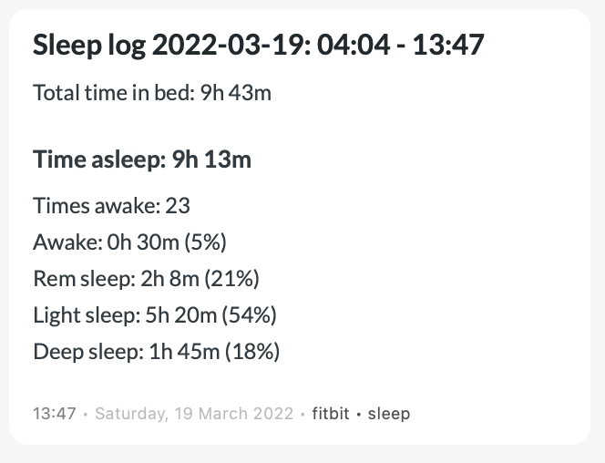

# Fitbit summary -> DayOne

After getting your [sleep data](https://dev.fitbit.com/build/reference/web-api/sleep/) (or by [range](https://dev.fitbit.com/build/reference/web-api/sleep/get-sleep-log-by-date-range/) ) through the Fitbit API, use this script to import the summary into DayOne.

It will use the date of the sleep summary and create an entry with the summary.

Be sure to change (line 4)

 `timezone="Europe/Amsterdam"` 

to the timezone of your location.

